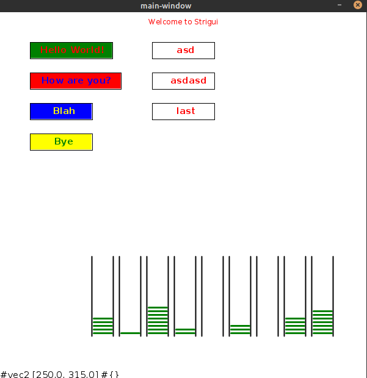

# strigui

[](https://clojars.org/strigui)

A simple straightforward GUI library for Clojure beginners like me. Currently contains Buttons, TextFields, Labels, the window component itself, and a weird component called stacks. I am planning to just create a few functions that allow components to be modified based on their name. 
Click events and "text modified" events are accessible via multi-methods.
That is probably going to change to rather supply a function per event and use
multi-methods for more "global" events only. For example for widget registered, unregistered, mouse clicked on empty space, etc. ... .

In project.clj:

```
:dependencies [[strigui "0.0.1-alpha1"]]
```

```
(ns example.core
  (:require [strigui.core :as gui]
            [strigui.events :as e]))

(defn -main
  ""
  [& args]
  (gui/window 600 600)
  (gui/label "welcome" "Welcome to Strigui" {:x 300 :y 20 :color [:red] :align [:center]})
  (gui/button "a" "Hello World!" {:x 50 :y 50 :color [:green :red]})
  (gui/button "b" "How are you?" {:x 50 :y 100 :color [:red :blue]})
  (gui/button "c" "Blah" {:x 50 :y 150 :color [:blue :yellow] :min-width 100})
  (gui/button "d" "Bye" {:x 50 :y 200 :color [:yellow :green] :min-width 100})
  (gui/input "inp1" "" {:x 250 :y 50 :color [:white :red] :min-width 100})
  (gui/input "inp2" "" {:x 250 :y 100 :color [:white :red] :min-width 100})
  (gui/input "inp3" "last" {:x 250 :y 150 :color [:white :red] :min-width 100})
  (gui/stacks "stacks" '(5 1 8 2 0 3 0 5 7) {:x 150 :y 400})
  (gui/find-by-name "inp2")
  (gui/remove! "inp1")
  (gui/update! "inp3" :value "Hello"))

(defmethod e/button-clicked "a" [btn]
  (gui/info "Button A pressed"))
```


