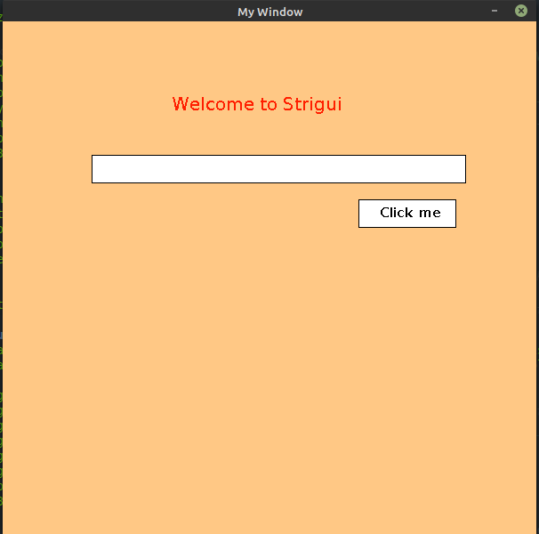

# strigui

[](https://clojars.org/strigui)

A small straightforward GUI library that can be extended with new Widgets. At the moment, it only contains widgets for a button, input, list and a label plus the window component itself.
The goal is to provide an easy to use library to create small desktop apps with Clojure. It should provide a few simple widgets to start with,
but you can create your own widgets too. 
It uses [Capra](https://github.com/MikeHardIce/Capra) underneath (it was using [Clojure2d](https://github.com/Clojure2D/clojure2d) before). So anything that can be drawn could potentially be a widget (like the game board in [Dame](https://github.com/MikeHardIce/Dame)).

[See Changes](CHANGES.md)

In project.clj:

```
:dependencies [[strigui "0.0.1-alpha28"]]
```
[Example](https://github.com/MikeHardIce/strigui-sample)

You need the core namespace.

```Clojure
(ns example.core
  (:require [strigui.core :as gui])
  (:import [java.awt Color]))

```
Create the main window via

```Clojure
(gui/window! 200 300 600 600 "My Window" (java.awt.Color. 255 200 133))
```
or

```Clojure
(gui/window! 200 300 600 600 "My Window" (java.awt.Color. 255 200 133) {java.awt.RenderingHints/KEY_ANTIALIASING java.awt.RenderingHints/VALUE_ANTIALIAS_ON})
```
to pass a map consiting of RenderingHint Keys and values to be applied when drawing widgets.

Basic widgets like buttons, input boxes and labels can be created via

```Clojure
(gui/swap-widgets! (fn [wdgs]
                       (-> wdgs
                           (gui/add-label "welcome" "Welcome to Strigui" {:x 190 :y 100
                                                                          :color [(Color. 255 31 0)]
                                                                          :font-size 20 :font-style [:bold]})
                           (gui/add-button "click" "Click me" {:x 400 :y 200 :color [Color/white Color/black]})
                           (gui/add-input "input" "" {:x 100 :y 150 :width 420 :color [Color/white Color/red] :min-width 420}))))
```
The parameters are the name of the widget, the value and a map for the position and optional settings like color, selected?, focused?, can-tab?, can-move? etc. ...
Each function takes the entire map of currently displayed widgets and returns the entire map of widgets.

Events can be attached by using the chosen widget name.

```Clojure
(gui/swap-widgets! (fn [wdgs]
                       (gui/attach-event wdgs "click" :mouse-clicked (fn [_ _] 
                                                                       (gui/close-window!)))))
```
Event functions should usually always return the entire widget map (which is normally the first parameter),
but since the window will close and end the program, it can be skipped.



Custom widgets can be defined by creating a record that implements the protocol of strigui.widget.Widget

```Clojure
(defprotocol Widget
  "collection of functions around redrawing widgets, managing the border etc. ..."
  (coord [this canvas] "gets the coordinates of the widget")
  (defaults [this] "attach default values once the widget gets created")
  (before-drawing [this] "modify the widget each time before it gets drawn")
  (draw [this canvas] "draw the widget, returns the widget on success"))
```
See [example](https://github.com/MikeHardIce/strigui-sample/blob/main/src/strigui_sample/widget_stacks.clj#L42) for reference

A custom widget could be invoked via

```Clojure
...
(:require ...
            [strigui-sample.widget-stacks :as st])
...
(gui/swap-widgets! (fn [wdgs]
                       (gui/add wdgs (st/->Stack "stacks" '(5 1 8 2 0 3 0 5 7) {:x 100 :y 400}))))
```

As mentioned in the begining, [Dame](https://github.com/MikeHardIce/Dame) is another example.

The game board and the 2 buttons are strigui widgets.

## Edn file

Widgets can now be loaded from a edn file too.

Example:
gui-test.edn
```Clojure
{:window [200 300 600 600 "From a edn file" (java.awt.Color. 255 200 133)]
 :strigui.label/Label [["welcome" "Welcome to Strigui
                                   and other stuff ..." {:x 190 :y 100 :z 20
                                                      :color [(java.awt.Color. 255 31 0)]
                                                      :font-size 20 :font-style [:bold]
                                                      :can-move? true :group "bla"}]]
 :strigui.button/Button [["click" "Click me" {:x 400 :y 250 :z 10 :color [java.awt.Color/white (java.awt.Color. 255 31 0)] :can-tab? true :group "bla"}]]
 :strigui.list/List [["test-list" [{:value "First Item"} {:value "Second Item"} {:value "Third Item"}
                                   {:value "4"} {:value "5"} {:value "6"} {:value "7"} {:value "8"} {:value "9"}] {:x 350 :y 300 :width 150
                                                                                                        :height 200
                                                                                                        :color [java.awt.Color/black java.awt.Color/red]}]]
 :strigui.input/Input [["input" "abc" {:x 100 :y 150 :z -20 :width 420 :color [java.awt.Color/white java.awt.Color/red] :selected? true :can-tab? true 
                                    :can-resize? true :can-move? true :group ["inputs" "bla"]}]
                       ["input1" "" {:x 100 :y 200 :color [java.awt.Color/white java.awt.Color/red] :width 420 :can-tab? true :group "inputs" :password? true}]]}
```

And load it in your clj file via
```Clojure
(ns example.core
  (:require [strigui.core :as gui]))

....
(gui/from-file! "gui-test.edn")
...
```

If a widget name already exists, the widget will get overriden by the new widget with the same name.
