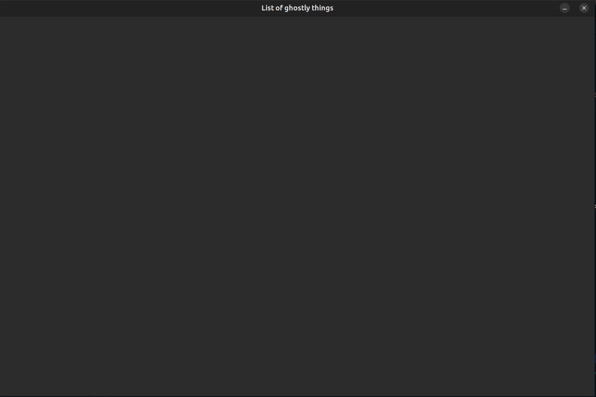

# Introduction to Strigui

Lets create a little app to collect a list of some ghostly things. For that, create a new project with Leiningen

```
lein new app ghostly-things
```
and then go to project.clj and add the strigui dependency

```Clojure
:dependencies [[org.clojure/clojure "1.11.1"]
                 [strigui "0.0.1-alpha32"]]  ;;<--- dependency to strigui
```

Just do a little
```
lein deps
```
in your terminal to download necessary jars.

Having done that, open you favorite IDE and go to src/ghosthly_things/core.clj

The first thing we need is a window. So lets add the require for strigui

```Clojure
(ns ghostly-things.core
  (:require [strigui.core :refer-all])  ;; <-- we can just refer all, in bigger projects use an alias via :as gui  for example
  (:gen-class))
```

A window is create via the window! function, which takes the following mandatory arguments:
x - x coordinate on the screen
y - y coordinate on the screen
width
height
title
and a few optional arguments afterwards:
color - a java.awt.Color
renderingHints - a map of java.awt.RenderingHints (Example: {java.awt.RenderingHints/KEY_ANTIALIASING java.awt.RenderingHints/VALUE_ANTIALIAS_ON})

However, we can skip the optional arguments, strigui will render by default using anti-aliasing.

So lets add a window to the main function
```Clojure
(defn -main
  [& args]
  (window! 100 50 1200 800 "List of ghostly things"))
```

and check it with 
```
lein run
```



Looks good so far, but we need some kind of a title. The swap-widgets! function is used to add, modify, remove, interact with widgets.
It requires a function that takes a map of widgets as its argument and expects this a map of widgets in return after evaluating that function.

```Clojure
(swap-widgets! #(-> %
                     ...
                     stuff
                     ... )
```

So basically all your widgets will be collected in the map and you simply use a function to transform this map to your liking. Strigui will
then figure out what needs to be redrawn.

widgets -> transform (your code) -> draw -> widgets -> transform (your code) -> draw -> .... 

There are a few functions in strigui.core that can help you during the transformation. But anyhow, lets add a title

```Clojure
(defn -main
  [& args]
  (window! 100 50 1200 800 "List of ghostly things")
  (swap-widgets! #(-> %
                      (add-label "title" "A wonderful collection of ghostly things" {:x 350 :y 50 :font-size 24}))))
```

Maybe we should at least collect information like the name, a description, food and how to stop it by adding some input fields

To add multiple widgets of the same type, we can use add-multiple which takes a widget type
followed by multiple widget-name widget-value pairs.

```Clojure
(add-multiple strigui.input.Input "txt-name" "" "txt-description" ""
                                    "txt-food" "" "txt-how-to-stop" "")
```

All of those widgets will appear at the top-left corner, so we need to arrange them by using arrange :D
Arrange will a number to indicate how many widgets should appear on the same row and the names of the widgets, that need to be arranged, as arguments.
Additional options can be provided, like from which position the arrangement should start, the spacing between widgets, as well as the widget alignment.
However, lets keep it simple for now

```Clojure
(arrange 1 {:from [200 200]} "txt-name" "txt-description" "txt-food" "txt-how-to-stop")
```

So overall we have until now

```Clojure
(defn -main
  [& args]
  (window! 100 50 1200 800 "List of ghostly things")
  (swap-widgets! #(-> %
                      (add-label "title" "A wonderful collection of ghostly things" {:x 350 :y 50 :font-size 24})
                      (add-multiple strigui.input.Input "txt-name" "" "txt-description" ""
                                    "txt-food" "" "txt-how-to-stop" "")
                      (arrange 1 {:from [200 200]} "txt-name" "txt-description" "txt-food" "txt-how-to-stop"))))
```

Maybe we should add labels for each text box as well

```Clojure
(add-multiple strigui.label.Label "lbl-name" "Name:" "lbl-description" "Description:"
                                    "lbl-food" "Food:" "lbl-how-to-stop" "Stop it with:")
(arrange 1 {:from [80 230] :space [0 42]} "lbl-name" "lbl-description" "lbl-food" "lbl-how-to-stop")
```

That looks a bit small, so we could change the property of multiple widgets with assoc-property,
which will take a property key, the new value and the names of the widgets this property should be applied to

```Clojure
(assoc-property :font-size 16 "lbl-name" "lbl-description" "lbl-food" "lbl-how-to-stop")
```

That looks better. We of course want to list all the wonderful ghostly things we entered. So lets get a list onto the screen

```Clojure
(add-list "ghostly-things" [] {:x 400 :y 200 :width 700 :height 500 :header [{:value "Name"}
                                                                            {:value "Description"}
                                                                            {:value "Food"}
                                                                            {:value "Stop it with"}]})
```

Ah maybe we want to sort the contents by those properties, we can do this by using actions

```Clojure
(add-list "ghostly-things" [] {:x 400 :y 200 :width 700 :height 500 :header [{:value "Name" :action :sort}
                                                                            {:value "Description" :action :sort}
                                                                            {:value "Food" :action :sort}
                                                                            {:value "Stop it with" :action :sort}]})
```